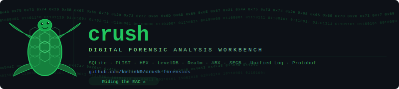
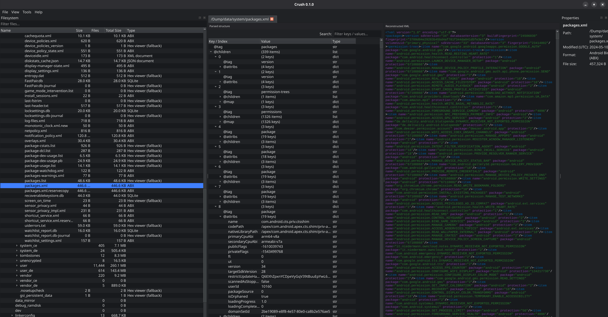
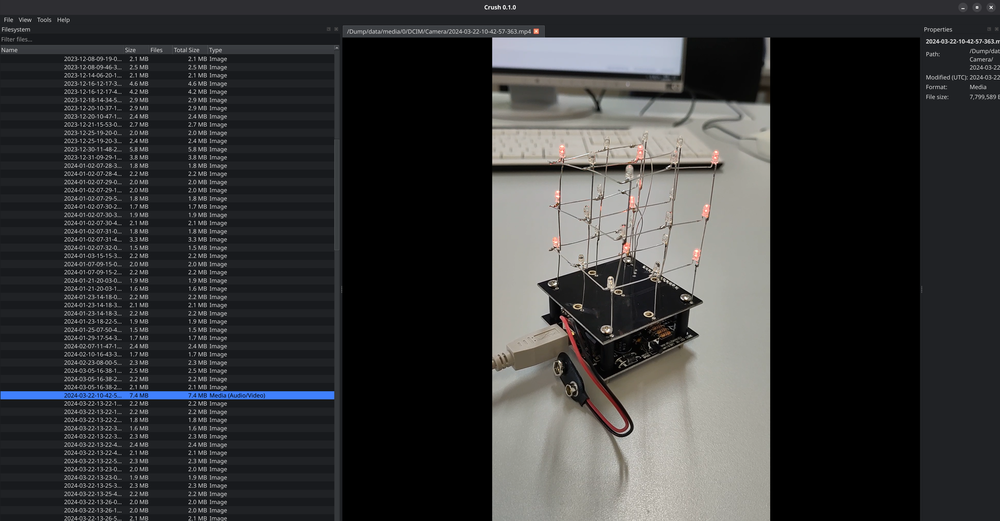
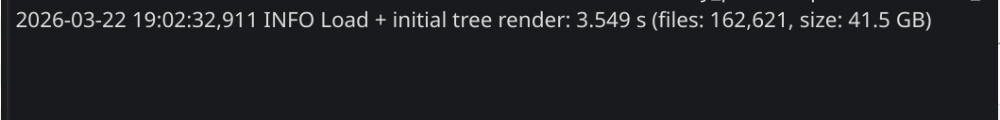
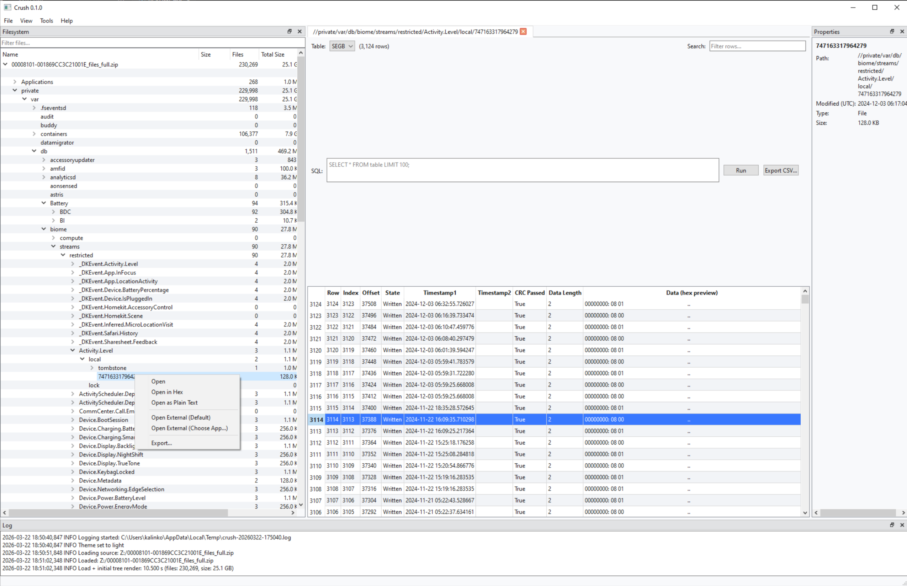
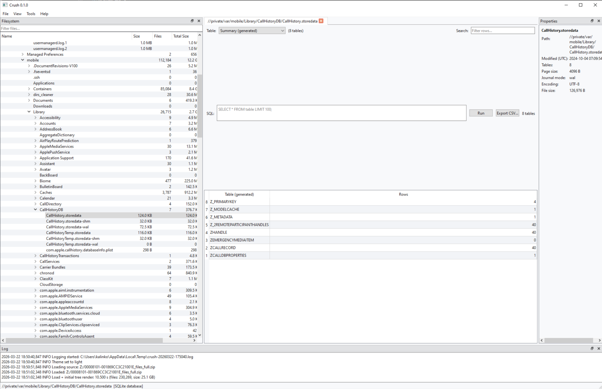
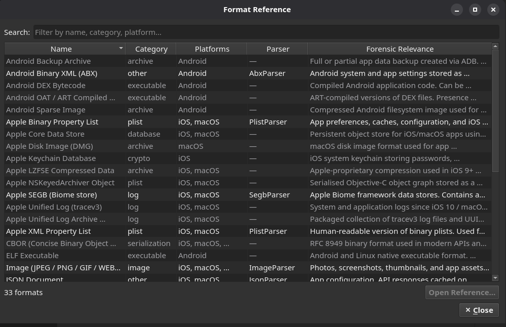
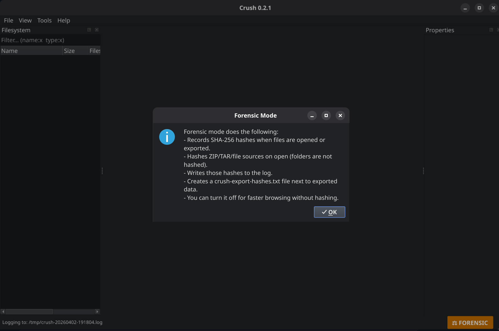

# crush-forensics



Crush — Digital Forensic Analysis Workbench

[](https://github.com/kalink0/crush-forensics/actions/workflows/ci.yml)
[](https://github.com/kalink0/crush-forensics/actions/workflows/nightly.yml)


[](https://github.com/kalink0/crush-forensics/releases)
[](https://github.com/kalink0/crush-forensics/blob/main/LICENSE)


## Features

Open and navigate ZIP and TAR archives, folders, and individual files without extracting anything to disk first.

**Built-in file format database** — Crush identifies forensically relevant formats by magic bytes and extension, and shows format name, platform, forensic relevance, and a link to the specification for every selected file, including formats without a dedicated viewer.

**Integrity mode** — optional hashing for auditability: file/ZIP/TAR sources are hashed on open and exports generate a hash manifest (`crush-export-hashes.txt`). Toggle via the bottom-right status badge.

Supported viewers (more planned):

- SQLite / Database Viewer
- Hex Viewer
- Text Viewer (with syntax highlighting and encoding detection)
- JSON Viewer (collapsible tree)
- XML Viewer (collapsible tree)
- Plist / BPlist Viewer
- SEGB v1/v2 Viewer
- ABX (Android Binary XML) Viewer
- LevelDB Viewer (Chrome LevelDB / Android app databases)
- Image Viewer
- Media Viewer (audio/video)
- Multi-Log Studio (multi-source log analysis with format auto-detection; Apple Unified Log / `.tracev3` / `.logarchive`, syslog, and more)
- Protobuf Viewer (schema-less; optional schema decoding)
- PDF text extraction (displays extracted text)
- Realm Database Viewer (header, schema/class extraction, top-ref comparison, table/column data decoding)

## Documentation

→ [User Handbook](crush/docs/handbook.md)
→ [Format Support & Parser Limitations](crush/docs/format-support.md)

## Blog & Deep Dives

Technical write-ups on the crush viewers — forensic background, workflow, and what to look for:

| Viewer | Post |
|--------|------|
| SQLite | [What Hides in the WAL — SQLite Forensics with crush](https://bebinary4n6.blogspot.com/2026/05/what-hides-in-wal-sqlite-forensics-with.html) |
| RealmDB | [Object by Object — RealmDB Forensics with crush](https://bebinary4n6.blogspot.com/2026/05/object-by-object-realmdb-forensics-with.html) |
| LevelDB | [Reading the CURRENT — LevelDB Forensics with crush](https://bebinary4n6.blogspot.com/2026/05/reading-current-leveldb-forensics-with.html) |
| SEGB / Biome | [Beyond the C — SEGB and Biome Forensics with crush](https://bebinary4n6.blogspot.com/2026/05/beyond-c-segb-and-biome-forensics-with.html) |
| Protobuf | [Reading Protobuf Wire Format Without a Map](https://bebinary4n6.blogspot.com/2026/06/reading-wire-protobuf-without-map.html) |

## Screenshots

Android ABX (Linux)


Android Video (Linux)


Loading Speed - How fast we can load from zips


iOS SEGB (Windows)


iOS SQLite Summary (Windows)


Format Reference (Linux)


Integrity Mode (Linux)


## Install and Run

### From source (recommended for development)

1. Create a virtual environment
```bash
python -m venv .venv
source .venv/bin/activate
```

2. Install dependencies
```bash
python -m pip install --upgrade pip
python -m pip install -e .
```

3. Download the Unified Log parser binaries (required for Apple `.tracev3` / `.logarchive` support)
```bash
python scripts/download_unifiedlog_binaries.py
```

4. Run Crush
```bash
crush
```

### Alternative run command

```bash
python -m crush
```

If you see missing Qt or media errors, install the system dependencies below.

## System Dependencies

Some Python packages require OS-level libraries on fresh machines.

### Base GUI/Qt runtime (PySide6)

These are required for the Qt GUI to run correctly on Linux.

- Debian/Ubuntu: `sudo apt-get install libgl1 libegl1 libxcb-xinerama0 libxkbcommon-x11-0`
- Fedora: `sudo dnf install mesa-libGL mesa-libEGL libxcb libxkbcommon-x11`
- Arch: `sudo pacman -S mesa libglvnd libxcb libxkbcommon-x11`
- Windows: no additional packages required; if the app fails to start, install the Microsoft Visual C++ Redistributable 2015-2022 (x64)
- macOS: no additional packages required (bundled with the OS)

### libmagic (for `python-magic`)

`python-magic` depends on `libmagic` being present on the system.

- Debian/Ubuntu: `sudo apt-get install libmagic1`
- Fedora: `sudo dnf install file-libs`
- Arch: `sudo pacman -S file`
- macOS (Homebrew): `brew install libmagic`
- Windows: no additional packages required

### Qt Multimedia (for audio/video)

`PySide6` uses system multimedia backends.

- Debian/Ubuntu: `sudo apt-get install gstreamer1.0-plugins-base gstreamer1.0-plugins-good`
- Fedora: `sudo dnf install gstreamer1-plugins-base gstreamer1-plugins-good`
- Arch: `sudo pacman -S gstreamer gst-plugins-base gst-plugins-good`
- macOS: typically bundled with Qt; if media playback fails, install `gstreamer`
- Windows: typically bundled with Qt; no additional packages required

### Audio backend (PulseAudio)

For Linux audio playback, `libpulse` is commonly required by Qt Multimedia.

- Debian/Ubuntu: `sudo apt-get install libpulse0`
- Fedora: `sudo dnf install pulseaudio-libs`
- Arch: `sudo pacman -S libpulse`

## Acknowledgements

This project builds on the great work of the DFIR community. The following third-party modules by [CCL Solutions Group](https://github.com/cclgroupltd) are bundled:

- [ccl_bplist](https://github.com/cclgroupltd/ccl-bplist) — Binary plist module (BSD 3-Clause)
- [ccl_segb](https://github.com/cclgroupltd/ccl_segb) — SEGB (Significant Energy Bearer) module (MIT)
- [ccl_leveldb](https://github.com/cclgroupltd/ccl-leveldb) — LevelDB / Chrome LevelDB module (MIT)

Apple Unified Log (`.tracev3` / `.logarchive`) parsing uses the [macos-UnifiedLogs](https://github.com/mandiant/macos-UnifiedLogs) `unifiedlog_iterator` binary by [Mandiant](https://github.com/mandiant) (Apache License 2.0). The binary is bundled automatically in portable builds. When running from source, run `scripts/download_unifiedlog_binaries.py` to download the platform binaries into `crush/bin/unifiedlog_iterator/` (they are git-ignored and never committed).

Parts of this software were developed with assistance from [Claude AI / Claude Code](https://claude.ai) by Anthropic.

## Bugs and feature requests

Use [GitHub Issues](https://github.com/kalink0/crush-forensics/issues). Please include the Crush version (shown in **Help → About**), your OS, and steps to reproduce.